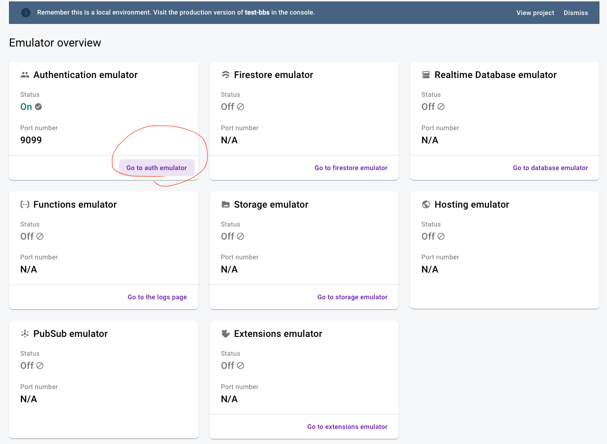
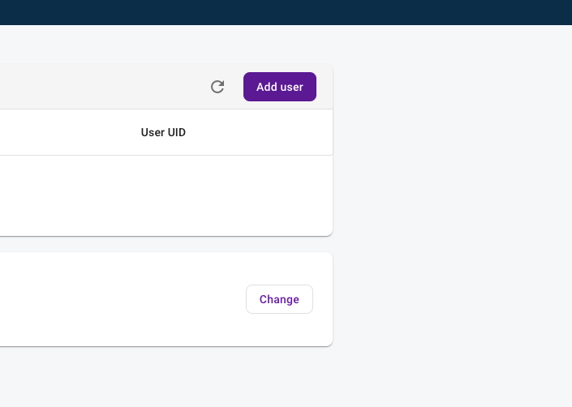
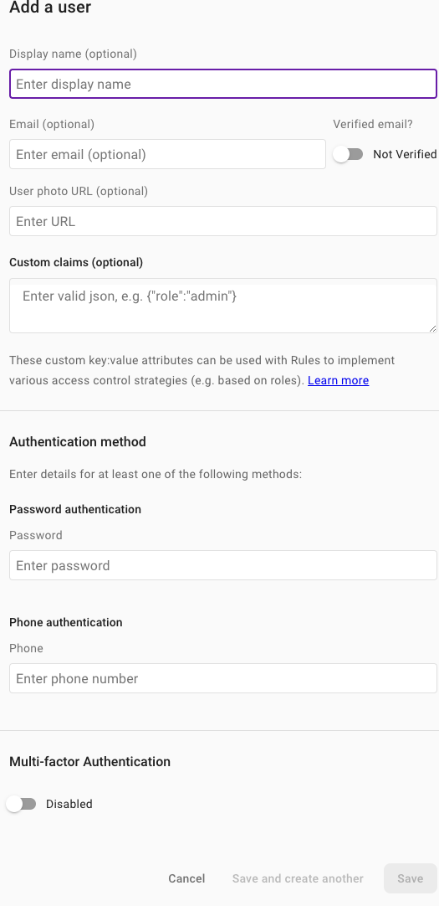

# bbs-test

## 技術構成

- 言語

  - Typescript

- Frontend

  - Next.js v14
  - React v18
  - tailwind v3.4.3
  - firebase v10
  - URQL v4
  - Zod v23
  - ReactHookForm v7

- Backend

  - NestJS v10
  - Firebase Admin
  - class-alidator
  - class-transfomer
  - jest

- ORM

  - Prisma

- API

  - GraphQL v16.8

- 構成

  - Turborepo

- 認証
  - firebase emulator

# 使い方

### URL

frontend: http://localhost:3000
firebase emulator: http://localhost:4000

## パッケージのインストール

```shell
> pnpm i
```

## コンテナの立ち上げ

```shell
> docker compose up
```

## pnpm prisma generate

```shell
> pnpm prisma:generate
```

## DB Migrate

```shell
> pnpm db:migrate
```

## DB seed

```shell
> pnpm db:seed
```

## 開発環境起動

```shell
> pnpm dev
```

## ユーザー情報登録(手動 :bow:)

- firebase emulato に入ってユーザーを登録します。

1. http://localhost:4000 にアクセス
2. 丸にアクセス
   
3. Add user
   
4. Email, Password を入力して Save
   

## 以上
